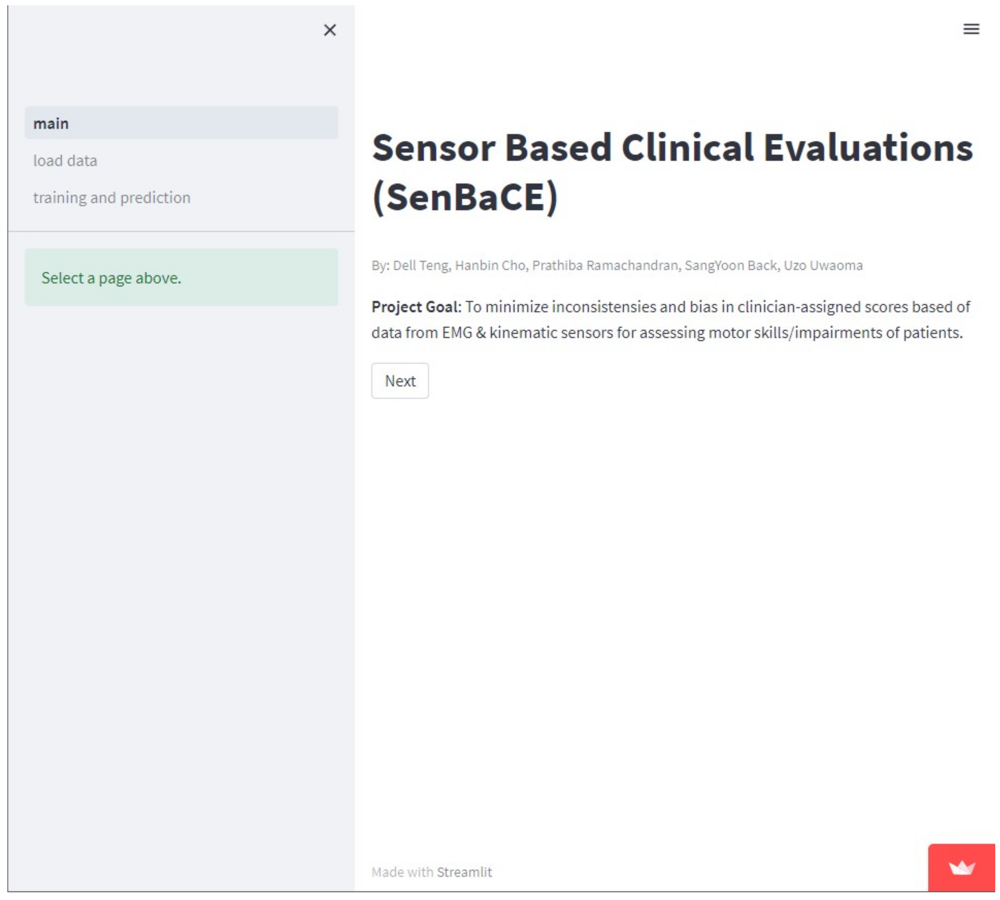
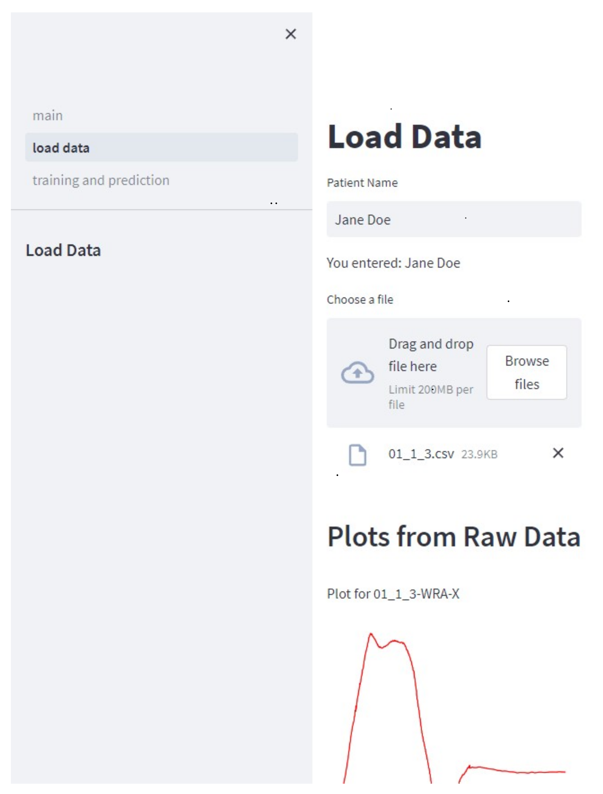
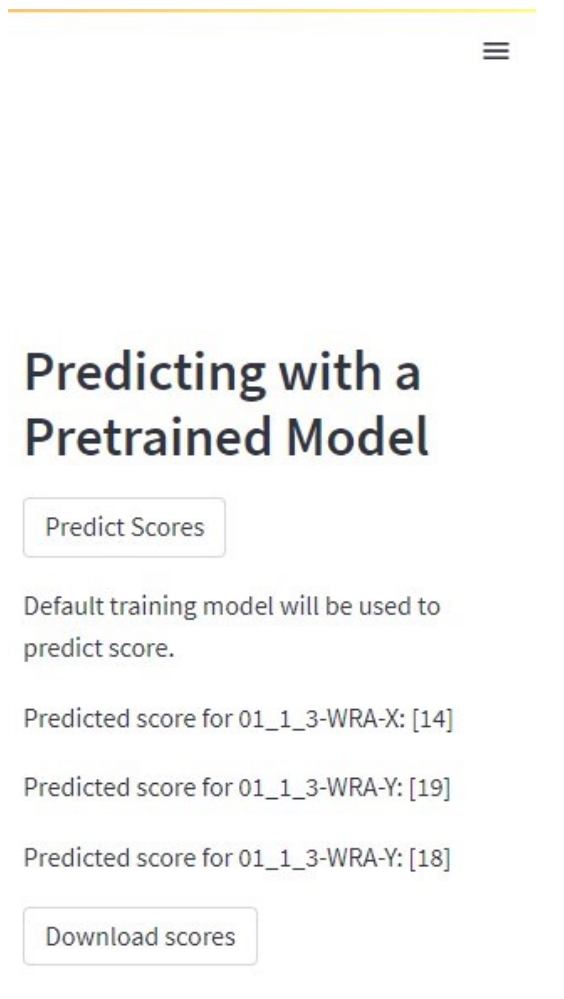
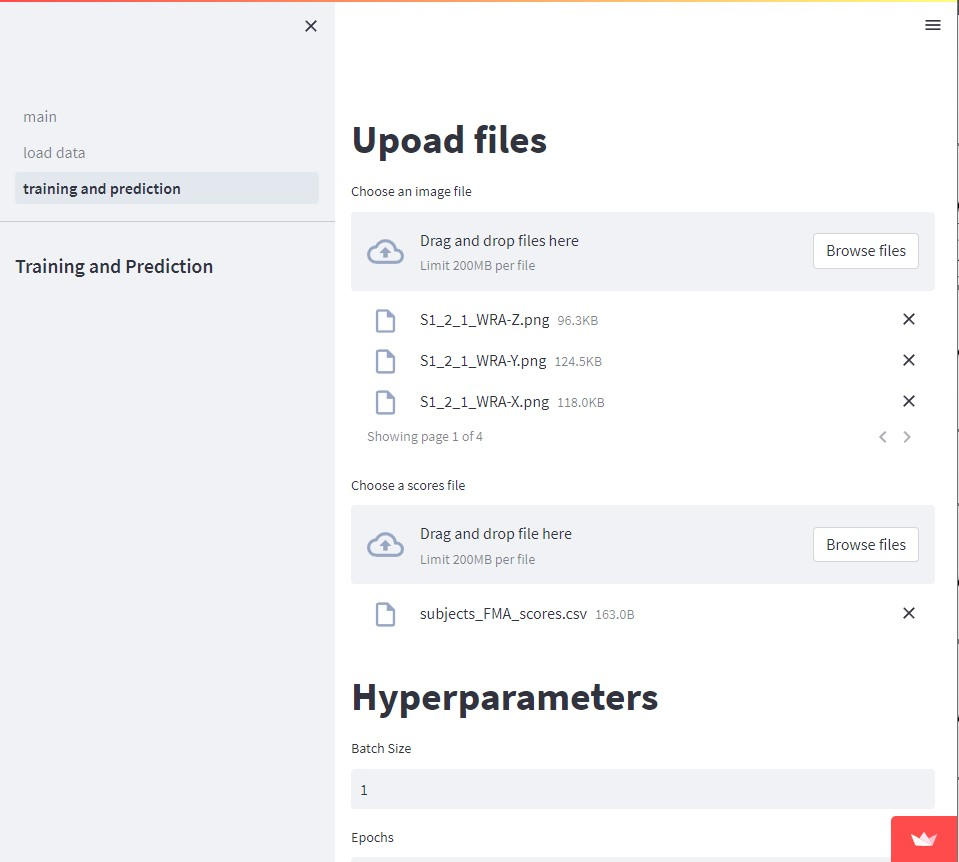
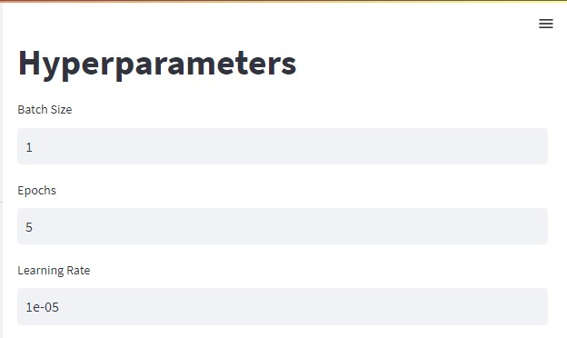
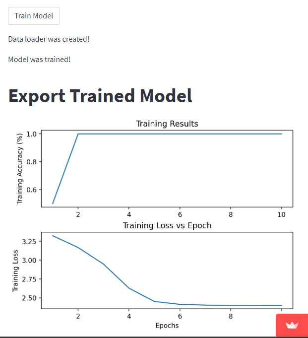

# </img> Sensor Based Clinical Evaluations (SenBaCE)
---
[](https://github.com/hanbincho/clinical-sensor-scoring/actions/workflows/python-package-conda.yml)

## Introduction
**SenBaCE** is a tool that aims to assign clinically relevant scores based off of plots created from sensor data collected during motor tasks from individuals with motor impairments.We inted to provide a quantitative evaluation of the impaired conditions, and to help the clinicians properly decide the rehabilitative process. This tool can be used for score prediction based off the [U-Limb](https://academic.oup.com/gigascience/article/10/6/giab043/6304920) dataset and training with custom data.  

**Dataset** U-Limb is a large, multimodal, multi-center dataset on human upper-limb movements. The kinematic data consists the position data of thorax, upper-and forearm markers. We are currently using the markers for thumb and little finger side
[Data](https://dataverse.harvard.edu/dataset.xhtml?persistentId=doi:10.7910/DVN/FU3QZ9)

---------------------------------------

### Purpose
Currently, there are standard clinical practices where trained physicians visually assess motor impairments of patients. Based off these visual assessments, these physicians will then assign a score, which describes the severity of patients' impairments. To minimize possible biases or inconsistencies between assessments, sensor data can be utilized as a more robust and consistent means to characterize motor behaviors. However, the outputs of sensor data are not clinically meaningful and somewhat difficult to understand without additional filtering and processing. By utilizing a publicly available dataset that has collected sensor data and the corresponding clinical evaluation scores (U-Limb), and machine learning model techniques, **SenBaCE** aims to bridge this gap and demonstrate a potentially more robust alternative to clinically characterizing motor impairments.

---------------------------------------

## How to use
**SenBaCE** can be accessed directly on the web or through the command line/local terminal.

* The web platform is hosted on Streamlit's server and can be accessed via this link ===> [SenBaCE](https://hanbincho-clinical-sensor-scoring-senbacemain-enhox7.streamlit.app/).
* To access **SenBaCE** via the command line/local terminal:
	> * Open a terminal and change your working directory to the desired location for the **SenBaCE** package.
	> * Clone the repoistory using `git clone https://github.com/hanbincho/clinical-sensor-scoring.git`
	> * `cd` into the repository `cd clinical-sensor-scoring`.
	> * Set up a new virtual environment with all necessary packages and their dependencies using `conda env create -f environment.yml`.
	> * Activate the virtual environment with `conda activate senbace`.
	> * `cd` into `senbace` package in the terminal via `cd senbace`
	> * In the terminal run `Streamlit run main.py --server.maxUploadSize 400`
	> * A link to the landing page is displayed on the terminal. With `Ctrl` pressed on the keyboard, click on the link to open the app.
	
* **SenBaCE**'s landing	page is similar for both methods of access and looks as shown below
<p align="center" width="100%">
	</img>
</p>

### Predicting scores for patient's sensor data
* To upload the sensor data for **ONE** patient saved in a csv file, click on  the`load data` menu on the sidebar.
	> * Enter the patient's name in the `Patient Name` text box and hit `Enter` on the keyboard.
	> * Drag and drop or click on `Browse files` to upload the patient's sensor data.
	>	*  Make sure that:
    >        * The csv file contains readings from only one sensor at a particular location on the patient's anatomy.
    >        * The csv file should be named using a user-preferred scheme which distinguishes patients.
    >        * The csv file must contain n-number of columns depending on the number of axes recorded using the sensor.
    >        * The first row of the csv file must specify an identifying tag for the sensor readings.
	>			* Format of the tag should be ###-$, where;
	>				* \### should be replaced by a 3 letter abbreviation for the sensor location; and
	>				* $ should be replaced by the axis of measurement for the sensor.
	>				* For example WRA-X to denote readings from the WRA sensor in the X-axis.
<p align="center" width="100%">	
	</img>
</p>

* Upon uploading, the plots for each column of sensor data in the uploaded csv file are generated and displayed on the screen.
* After all plots have been generated, on the right of the page, click the `Predict Score` button.
	* This uses the pretrained ML models to assign scores for each column of sensor data.
	* The predicted scores are displayed on the screen.
	* Clicking the `Download Scores` button, downloads a text file containing the predicted scores for each sensor data as displayed on the page. 
<p align="center" width="100%">	
	</img>
</p>

### Training model using newly acquired sensor data.
The preinstalled ML model can also be fine-tuned as detailed below. 
* On the sidebar of the landing page which was shown above, select the `training and prediction` menu. 
<p align="center" width="100%">	
	</img>
</p>

* In the `Choose an image file` section, Drag and drop or click on `Browse files` to upload `.png` plots of patients sensor data.
* In the `Choose a scores file` section, Drag and drop or click on `Browse files` to upload a `.csv` file containing the labels for each health category.
* Scroll down to the `Hyperparameters` section of the page and edit the `Batch Size`, `Epochs`, & `Learning Rate` options to suit. 
<p align="center" width="100%">	
	</img>
</p>

* Scroll down and click on the `Train Model` button.
* When the training is competed the plots for training accuracy and training loss are displayed on the page.
	* Note that these plots will only be generated for `Epochs` > 1. 
<p align="center" width="100%">	
	</img>
</p>

---------------------------------------

## Repository Structure
```
├── LICENSE
├── README.md
├── doc
│   ├── software_design.md
│   └── images
│   │   ├── electromyography.png
│   │   ├── hyperParameters.jpg
│   │   ├── loadData.png
│   │   ├── predictScore.png
│   │   ├── senbaceLandingPage.png
│   │   ├── trainedModel.jpg
│   │   ├── trainingPrediction.jpg
├── environment.yml
├── image.png
├── senbace
│   ├── __init__.py
│   ├── alexnet_model.py
│   ├── generated_plots_for_prediction
│   │   ├── 01_1_3-WRA-X.png
│   │   ├── 01_1_3-WRA-Y.png
│   │   └── 01_1_3-WRA-Z.png
│   ├── main.py
│   ├── make_prediction.py
│   ├── pages
│   │   ├── 1_load_data.py
│   │   └── 2_training_and_prediction.py
│   ├── process_data.py
│   ├── save_prediction.py
│   └── train_model.py
└── tests
    ├── __init__.py
    ├── random_test_signals
    │   ├── create_random_sensor_data.py
    │   ├── edge_case_test_signal1.csv
    │   ├── edge_case_test_signal2.csv
    │   ├── smoke_test_signal1-ABC-X.png
    │   ├── smoke_test_signal1-DEF-Y.png
    │   ├── smoke_test_signal1-GHI-Z.png
    │   ├── smoke_test_signal1.csv
    │   ├── smoke_test_signal2-abc-x.png
    │   ├── smoke_test_signal2-lst-z.png
    │   ├── smoke_test_signal2-opq-y.png
    │   └── smoke_test_signal2.csv
    ├── test_images
    │   ├── S1_1_1_WRA-X.png
    │   ├── S1_1_1_WRA-Y.png
    │   ├── S1_1_1_WRA-Z.png
    │   ├── S2_1_1_WRA-X.png
    │   ├── S2_1_1_WRA-Y.png
    │   ├── S2_1_1_WRA-Z.png
    │   ├── S3_1_1_WRA-X.png
    │   ├── S3_1_1_WRA-Y.png
    │   └── S3_1_1_WRA-Z.png
    ├── test_make_prediction.py
    ├── test_model
    │   └── alexnet_model_pretrained.pth
    ├── test_process_data.py
    ├── test_train_model.py
```

---------------------------------------

SenBaCE logo adopted from [Icon8](https://icons8.com/icons/set/Electromyograph).

